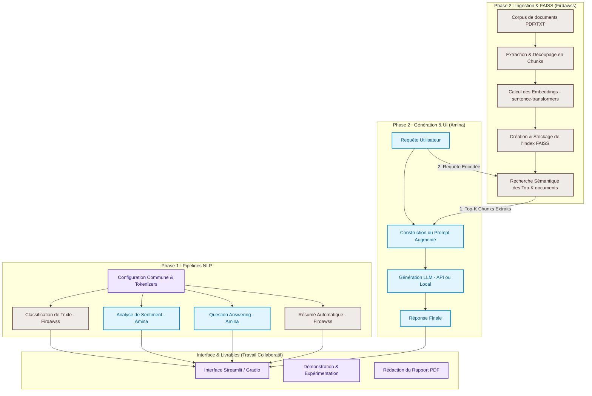

# 🚀 Plan de Projet : Transformers & Systèmes RAG (Retrieval-Augmented Generation)

Ce document sert de guide complet pour la réalisation de votre mini-projet en NLP (Ingénierie des Données, ENSA Al Hoceima). Il détaille l'explication théorique et pratique du projet basé sur les consignes du PDF et le livre de référence *"Natural Language Processing with Transformers"*, propose une architecture modulaire robuste, fournit un diagramme de flux clair et répartit équitablement les tâches entre **Amina** et **Firdawss** afin de vous permettre de travailler en parallèle de manière fluide et sans conflits de code.

---

## 📖 1. Compréhension Globale & Étapes du Projet

Le projet est divisé en deux grandes parties complémentaires :

### 🔹 Partie 1 : Exploration des Transformers et Tâches NLP
* **Objectif** : Se familiariser avec l'écosystème Hugging Face (`transformers`, `tokenizers`, `pipelines`).
* **Concept** : Utiliser des modèles pré-entraînés pour accomplir les quatre tâches de base du NLP demandées :
  1. **Classification de texte** (ex: classifier le sujet d'un texte) $\rightarrow$ *Livre de Réf. : Chapitre 2 & 9*
  2. **Analyse de sentiment** (déterminer la polarité positive/négative/neutre) $\rightarrow$ *Livre de Réf. : Chapitre 2*
  3. **Question Answering (QA)** (extraire la réponse à une question à partir d'un contexte fourni) $\rightarrow$ *Livre de Réf. : Chapitre 7*
  4. **Résumé automatique (Summarization)** (générer un condensé d'un texte long) $\rightarrow$ *Livre de Réf. : Chapitre 6*

### 🔹 Partie 2 : Systèmes RAG (Retrieval-Augmented Generation)
* **Objectif** : Surmonter les limitations des modèles de langage (LLM) comme les hallucinations ou l'absence de connaissances récentes/privées en leur fournissant une base de connaissances externes.
* **Concept** : Le système fonctionne en 3 temps (Indexation, Récupération, Génération) :
  1. **Indexation** : Découper un corpus (ex: des fichiers PDF ou textes de cours) en petits morceaux (chunks), les transformer en vecteurs numériques (embeddings) à l'aide d'un modèle de type `sentence-transformers`, puis stocker ces vecteurs dans un index vectoriel (comme **FAISS**).
  2. **Récupération (Retrieval)** : Quand l'utilisateur pose une question, encoder cette question avec le même modèle d'embeddings, chercher dans FAISS les $k$ morceaux de texte les plus similaires sémantiquement.
  3. **Génération (Augmented Generation)** : Injecter ces morceaux pertinents dans un prompt structuré (le contexte) envoyé au LLM (modèle génératif local comme Llama/Gemma ou via API comme HuggingFace/Gemini/OpenAI) pour qu'il formule une réponse ultra-précise basée uniquement sur vos documents.

---

## 🏗️ 2. Architecture Technique du Projet

Pour travailler en parallèle, l'architecture du projet doit être hautement modulaire. Nous recommandons la structure de dossiers suivante :

```text
nlp-rag-project/
│
├── data/                               # Dossier contenant vos documents sources (PDF, TXT)
│   └── corpus/
│       └── documents_cours.pdf
│
├── notebooks/                          # Notebooks de prototypage et d'expérimentation
│   ├── 01_exploration_transformers.ipynb
│   └── 02_experimentation_rag.ipynb
│
├── src/                                # Code source modulaire de l'application
│   ├── __init__.py
│   ├── config.py                       # Variables de configuration (modèles, hyperparamètres)
│   │
│   ├── core_nlp/                       # --- BLOC AMINA (Partie 1) ---
│   │   ├── __init__.py
│   │   └── nlp_pipelines.py            # Classification, Sentiment, QA, Résumé
│   │
│   ├── rag_engine/                     # --- BLOC FIRDAWSS (Partie 2 - Index & Retrieval) ---
│   │   ├── __init__.py
│   │   ├── document_loader.py          # Extraction de texte des PDF et chunking (LangChain)
│   │   ├── embedding_model.py          # Encodage sémantique des textes (SentenceTransformers)
│   │   └── vector_store.py             # Création et requêtage de la base FAISS
│   │
│   └── generator/                      # --- BLOC AMINA (Partie 2 - Génération) ---
│       ├── __init__.py
│       └── llm_generator.py            # Construction du prompt et appel LLM (API/Local)
│
├── app.py                              # Interface utilisateur Streamlit ou Gradio (Amina & Firdawss)
├── requirements.txt                    # Dépendances Python
└── README.md                           # Documentation d'installation et d'utilisation
```

---

## 📊 3. Diagramme de Flux et Attribution des Tâches (Mermaid)

Voici le diagramme de flux complet du système. Les couleurs indiquent les responsabilités de chacun pour faciliter le travail simultané.



---

## 🤝 4. Contrat d'Interface & Collaboration en Parallèle

Pour éviter que l'une bloque l'autre, vous devez définir des **contrats d'interfaces (signatures de fonctions)**. Firdawss peut développer sa partie de recherche vectorielle pendant qu'Amina développe la génération en simulant la recherche de Firdawss avec des données fictives (mocking).

### 📝 Le fichier commun de configuration : `src/config.py`
Créez ce fichier dès le départ pour centraliser les choix technologiques.

```python
# src/config.py
import os

# Choix des modèles Hugging Face
NLP_CLASSIFIER_MODEL = "distilbert-base-uncased-finetuned-sst-2-english"
NLP_SUMMARIZER_MODEL = "facebook/bart-large-cnn"
NLP_QA_MODEL = "deepset/roberta-base-squad2"

# Choix des modèles RAG
EMBEDDING_MODEL_NAME = "all-MiniLM-L6-v2" # Ultra léger et très performant
GENERATIVE_LLM_MODEL = "google/gemma-2b-it" # Ou utilisation d'une API (Gemini/HuggingFace)

# Hyperparamètres RAG
CHUNK_SIZE = 500
CHUNK_OVERLAP = 50
VECTOR_DB_PATH = "data/faiss_index"
CORPUS_DIR = "data/corpus"
```

---

## 👩‍💻 5. Répartition Détaillée des Tâches (Par Phase Séquentielle)

> [!NOTE]
> Pour assurer un apprentissage optimal et une collaboration équilibrée, le projet est divisé en **deux phases chronologiques**. La **Phase 1** doit être entièrement complétée et validée par les deux personnes avant de débuter la **Phase 2**.

---

### 📍 PHASE 1 : Exploration des Transformers & Pipelines NLP (Partie 1)
*Objectif : Mettre en œuvre et tester les 4 tâches NLP de base en se partageant équitablement le travail.*

#### 🟦 Tâches d'**Amina** (Phase 1)
1. **Analyse de sentiment** (`src/core_nlp/nlp_pipelines.py`) $\rightarrow$ *Livre de Réf. : Chapitre 2*
   * Configurer le pipeline Hugging Face d'analyse de sentiment.
   * Créer une fonction retournant le score de sentiment et le label associé (Positif / Négatif / Neutre).
2. **Question Answering (QA)** (`src/core_nlp/nlp_pipelines.py`) $\rightarrow$ *Livre de Réf. : Chapitre 7*
   * Configurer le pipeline de Question Answering basé sur un contexte (ex: RoBERTa-base-SQuAD2).
   * Implémenter la fonction d'extraction de réponse à partir d'un paragraphe donné.
3. **Architecture Commune** : Initialiser l'arborescence des fichiers et configurer `src/config.py`.

#### 🟫 Tâches de **Firdawss** (Phase 1)
1. **Classification de texte** (`src/core_nlp/nlp_pipelines.py`) $\rightarrow$ *Livre de Réf. : Chapitres 2 & 9*
   * Charger un modèle de classification de texte Hugging Face (ex: DistilBERT ou Zero-Shot Classifier).
   * Écrire la fonction de classification de texte et tester différentes entrées.
2. **Résumé automatique (Summarization)** (`src/core_nlp/nlp_pipelines.py`) $\rightarrow$ *Livre de Réf. : Chapitre 6*
   * Configurer le pipeline de résumé avec un modèle de type BART ou T5.
   * Écrire la fonction de résumé de textes longs avec des contraintes de taille (`max_length` / `min_length`).
3. **Notebook de Validation** : Créer `notebooks/01_exploration_transformers.ipynb` pour importer et tester les 4 pipelines développés en commun sur un dataset d'exemples académiques.

---

### 📍 PHASE 2 : Conception du Système RAG Complet (Partie 2)
*Objectif : Bâtir le moteur RAG et l'interface utilisateur Streamlit pour interroger des PDF.*

#### 🟫 Tâches de **Firdawss** (Phase 2 - Pipeline d'Ingestion & Moteur Vectoriel)
1. **Ingestion & Découpage** (`src/rag_engine/document_loader.py`) :
   * Implémenter le chargement des fichiers PDF de cours.
   * Implémenter le découpage (Text Splitter) en morceaux (chunks) de 500 caractères avec chevauchement de 50.
2. **Embeddings & FAISS** (`src/rag_engine/embedding_model.py` et `vector_store.py`) :
   * Charger le modèle `sentence-transformers` pour encoder les chunks en vecteurs de dimension fixe.
   * Créer l'index vectoriel local **FAISS** et enregistrer l'index sur le disque.
3. **Moteur de Recherche Sémantique** :
   * Écrire la méthode `search_top_k(query, k)` qui encode la requête de l'utilisateur, interroge FAISS, et renvoie les $k$ textes les plus pertinents ainsi que leurs métadonnées (nom du fichier PDF, numéro de page).

#### 🟦 Tâches d'**Amina** (Phase 2 - Génération LLM & Interface Streamlit)
1. **Moteur Génératif** (`src/generator/llm_generator.py`) :
   * Rédiger le template de prompt pour instruire le LLM de ne répondre qu'en fonction du contexte fourni.
   * Connecter le LLM (modèle local léger comme Gemma ou API comme Gemini/HuggingFace) pour générer la réponse à partir de la question et des documents extraits par Firdawss.
2. **Interface Streamlit Globale** (`app.py`) :
   * Développer l'interface interactive pour faire la démo complète du projet avec :
     * **Onglet 1 : Boîte à outils NLP** (Permet de tester les pipelines de la Phase 1 sur des textes saisis).
     * **Onglet 2 : Chatbot RAG Intelligent** (Permet de charger les PDF de cours, d'interroger le RAG et de comparer les réponses avec / sans RAG).
3. **Comparaison & Tests** : Gérer l'affichage des sources utilisées (nom du fichier, numéro de page) sous les réponses du chatbot.

---

## 🔗 6. Modèles de Code pour démarrer en Parallèle

Pour s'assurer que vos codes s'assemblent sans encombre, voici les squelettes exacts des fichiers à utiliser.

### 🟫 Firdawss : Squelette de Recherche Vectorielle (`src/rag_engine/vector_store.py`)

```python
# src/rag_engine/vector_store.py
from typing import List, Dict
import os
from sentence_transformers import SentenceTransformer
import faiss
import numpy as np
from src.rag_engine.document_loader import get_chunks # Fera le chargement + split

class VectorStoreManager:
    def __init__(self, model_name: str, index_path: str):
        self.encoder = SentenceTransformer(model_name)
        self.index_path = index_path
        self.index = None
        self.documents = [] # Liste de dictionnaires {"id": int, "text": str, "source": str}

    def build_and_save_index(self, chunks: List[Dict[str, str]]):
        """
        Reçoit une liste de chunks sous la forme [{"text": "...", "source": "page_3.pdf"}]
        Calcule les embeddings et initialise l'index FAISS.
        """
        self.documents = chunks
        texts = [c["text"] for c in chunks]
        
        # 1. Calculer les embeddings
        embeddings = self.encoder.encode(texts, show_progress_bar=True)
        dimension = embeddings.shape[1]
        
        # 2. Créer l'index FAISS
        self.index = faiss.IndexFlatL2(dimension)
        self.index.add(np.array(embeddings).astype('float32'))
        
        # 3. Sauvegarder l'index et les documents associés
        # (Firdawss pourra implémenter une sauvegarde simple via pickle ou json)
        print(f"✅ Index FAISS créé avec {self.index.ntotal} documents.")

    def search_top_k(self, query: str, k: int = 3) -> List[Dict[str, str]]:
        """
        Encode la requête et retourne les K documents les plus proches.
        """
        if self.index is None:
            raise ValueError("L'index FAISS n'est pas initialisé ou chargé !")
            
        query_vector = self.encoder.encode([query])
        distances, indices = self.index.search(np.array(query_vector).astype('float32'), k)
        
        results = []
        for idx in indices[0]:
            if idx < len(self.documents):
                results.append(self.documents[idx])
        return results
```

### 🟦 Amina : Squelette de Génération RAG (`src/generator/llm_generator.py`)

```python
# src/generator/llm_generator.py
from typing import List, Dict

class RAGGenerator:
    def __init__(self, model_name_or_api_key: str):
        # Amina peut ici initialiser son modèle local ou son client API
        pass

    def build_prompt(self, query: str, contexts: List[Dict[str, str]]) -> str:
        """
        Formate le prompt augmenté avec les contextes trouvés par Firdawss.
        """
        combined_context = "\n\n".join([
            f"[Source: {c['source']}]\n{c['text']}" 
            for c in contexts
        ])
        
        prompt = f"""Vous êtes un assistant IA pédagogique et rigoureux.
Répondez de manière structurée et claire à la question posée en vous basant uniquement sur le contexte ci-dessous.
Si la réponse ne figure pas dans le contexte fourni, dites simplement : "Je ne trouve pas la réponse dans les documents fournis."

Contexte extrait du cours :
---------------------
{combined_context}
---------------------

Question de l'étudiant : {query}

Réponse claire et détaillée :"""
        return prompt

    def generate(self, query: str, contexts: List[Dict[str, str]]) -> str:
        """
        Assemble le prompt et génère le texte de réponse final.
        """
        prompt = self.build_prompt(query, contexts)
        
        # Simulation (Mocking) si Firdawss n'a pas fini :
        # return f"Réponse fictive basée sur la question : '{query}'"
        
        # Code de génération réel (Amina appellera le pipeline de génération ici)
        # response = self.llm(prompt)
        # return response
        return "Réponse générée (à connecter au modèle LLM d'Amina)"
```

---

## 🏁 7. Démonstration & Expérimentation Commune

Le PDF du mini-projet demande de tester le système avec :
1. **Des questions sur le corpus** : Préparez une liste de 5 questions clés tirées de vos cours dont les réponses sont spécifiques et ne peuvent pas être inventées par un LLM généraliste.
2. **Une comparaison entre réponses avec et sans RAG** :
   * **Sans RAG** : Envoyez la question directement au LLM sans contexte. Observez ses réponses vagues ou erronées (hallucinations).
   * **Avec RAG** : Envoyez le prompt augmenté. Obversez la précision de la réponse appuyée par les extraits de cours et les citations de sources.
3. **Livrables à préparer ensemble** :
   * **Le Rapport PDF** : Rédigez-le au fur et à mesure. Il doit inclure l'état de l'art (définitions RAG, Fine-tuning vs Prompt engineering vs RAG), l'architecture détaillée (votre diagramme Mermaid), et les résultats comparatifs avec des captures d'écran de l'application Streamlit.

---

## 🛠️ 8. Plan de Travail Étape par Étape

### 📅 PHASE 1 : Exploration & Pipelines NLP
| Étape | Activité | Réalisé par | Collaboration / Intégration |
| :--- | :--- | :--- | :--- |
| **Étape 1.1** | Configuration initiale du projet : création du repo Git, configuration de l'environnement virtuel et de `src/config.py`. | **Amina & Firdawss** | Partage du `requirements.txt` commun. |
| **Étape 1.2** | Implémentation des pipelines de Sentiment et Question Answering (QA). | **Amina** | Intégration dans `src/core_nlp/nlp_pipelines.py`. |
| **Étape 1.3** | Implémentation des pipelines de Classification et Résumé. | **Firdawss** | Intégration dans `src/core_nlp/nlp_pipelines.py`. |
| **Étape 1.4** | Tests croisés de la Phase 1 et finalisation du premier Notebook de validation. | **Amina & Firdawss** | Création de `notebooks/01_exploration_transformers.ipynb`. |

### 📅 PHASE 2 : Système RAG & Interface
| Étape | Activité | Réalisé par | Collaboration / Intégration |
| :--- | :--- | :--- | :--- |
| **Étape 2.1** | Création du module d'ingestion des PDF de cours (Loader + Chunking). | **Firdawss** | Dépôt des documents dans `data/corpus`. |
| **Étape 2.2** | Création de l'indexation sémantique (Embeddings) et stockage dans l'index FAISS local. | **Firdawss** | Validation de la recherche avec `search_top_k()`. |
| **Étape 2.3** | Implémentation de la génération de prompt RAG et connexion du LLM (Local ou API). | **Amina** | Importation de `VectorStoreManager` de Firdawss. |
| **Étape 2.4** | Développement de l'interface Streamlit complète (`app.py`). | **Amina** | Intégration de l'onglet de la Phase 1 et de l'onglet RAG. |
| **Étape 2.5** | Tests de comparaison (avec vs sans RAG) et rédaction conjointe du rapport final en PDF. | **Amina & Firdawss** | Finalisation du rapport, schémas et captures d'écran. |

---

💡 **Conseil de démarrage** : 
1. Initialisez un dépôt Git privé pour le projet.
2. Firdawss travaille sur la branche `feature/rag-retrieval` pour l'ingestion et la base vectorielle.
3. Amina travaille sur la branche `feature/nlp-and-generation` pour les pipelines NLP, le prompt et Streamlit.
4. Fusionnez vos branches une fois les étapes 4 et 5 validées individuellement ! 
